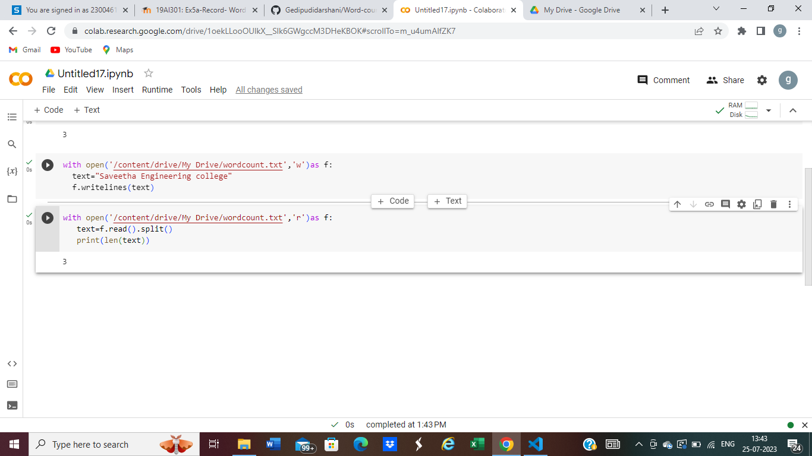

# Word-count
## AIM:
To write a python program for getting the word count from a text.
## EQUIPEMENT'S REQUIRED: 
PC
Anaconda - Python 3.7
## ALGORITHM: 
### Step 1:
Create a file,enter your text and export the file to  your google drive.
### Step 2: 
Give the commands for the program. 
### Step 3: 
To get word count we must use spilt command and spilt the words.
### Step 4:  
We must use len command to know the length of the file.
### Step 5: 
print the len(text)
### Step 6: 
End the program
## PROGRAM:
``````
#Program to get the word count.
#Developed by :Gedipudi Darshani
#RegisterNumber: 23004619
with open('/content/drive/My Drive/wordcount.txt,'w')as f:
  text="Saveetha Engineering college"
f.writelines(text)

with open('/content/drive/My Drive/wordcount.txt,'w')as f:
  text=f.read().spilt()
  print(ln(text))
``````
### OUTPUT:


## RESULT:
Thus the program is written to find the word count from a text.
